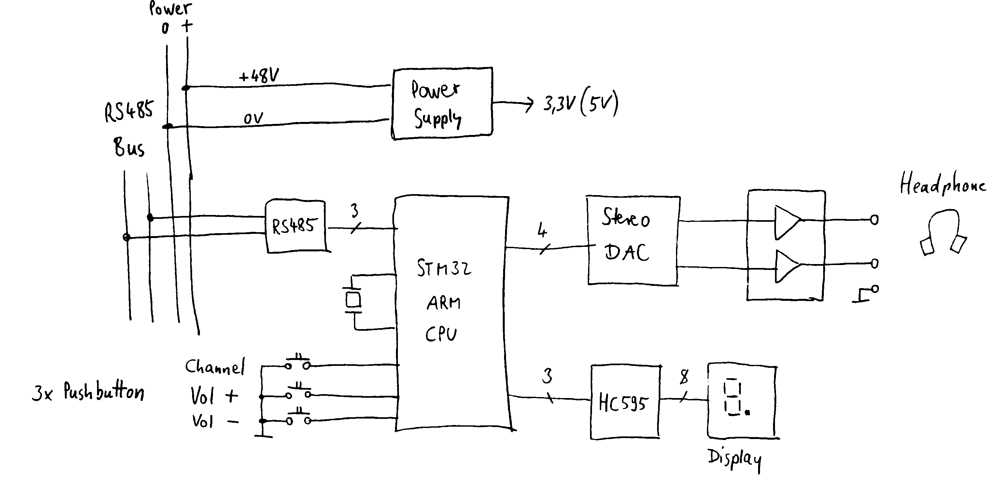

# Digital Multilingual Interpreter System Over RS-485

## Concept
There was a need to create a multi-channel interpreter system that transmits audio data via RS-485 bus. The system includes permanently installed listener units that are wired using CAT6 cable. These units have a very simple user interface:

- Channel selection buttons (+/-)
- Volume control buttons (+/-)
- Display to show the selected channel number and volume level

Users can choose from several languages (channels), and the original language can also be selected, which is an important feature for people with severe hearing impairments.

### Data Transmission
For the audio stream we will use plain PCM samples.

- Advantages of PCM: no encoding/decoding is required, which keeps the software simple.
- Disadvantages: PCM needs a relatively large bandwidth on the communication channel.

### Bus Architecture

Transmitting such a high-volume data stream demands a fast communication medium. Two candidates were considered: Ethernet and high-speed RS-485.

#### Ethernet
Drawbacks:
- The hardware and software stack are complex (requires transformer, PHY, and a full Ethernet protocol stack).
- A star topology is needed, which means the system would require many switches.

Benefits:
- Each listener unit is galvanically isolated
- Provides a very high bandwidth

#### RS-485
Benefits:
- Simpler hardware and software (just a UART with an RS-485 driver)
- Bus topology allows all units to be daisy-chained on a single cable, reducing wiring effort.

Drawbacks:
- The bus is not inherently galvanically isolated; isolation components must be added if separation is required.

#### Conclusion
Given our priorities—simplicity of hardware/software and minimal cabling—the RS-485 bus is the optimal choice, provided we employ high-speed RS-485 transceivers capable of several megabits per second to accommodate the PCM data rate. We will provide galvanic isolation only between bus sections, with each section containing several units.

## Hardware

### First idea
Block diagram with the main parts:

- RS-485 driver
- STM32 ARM microcontroller with I2S audio interface
- DAC (digital-to-analog converter)
- Stereo power-amp (headphone amplifier)
- Pushbuttons
- Display
- Power supply

### Final Hardware
Main parts:
- STM32H533RET microcontroller (512k flash, 272k RAM, max.250MHz, TQFP-64)
- 2x RS485 port
- 2x TLV320AIC3104 audio codec (ADC+DAC, mic. preamp with AGC, stereo headphone amp)
- 8x pushbuttons
- 2x 1.3" OLED 128x64 dotmatrix display (SH1106, SPI)
- I2C serial EEPROM
- 4-pol 3.5mm jack connector
- 2x RJ-45 connector
- power supply